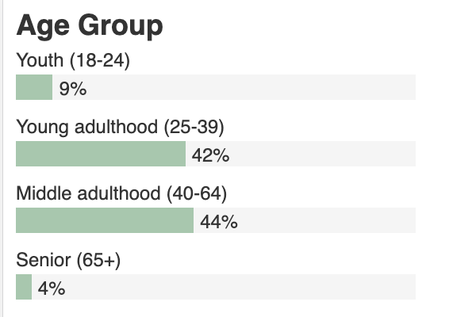

# How to build a bar chart using Vue.js

Recently, PNGK has worked with [HiiL (The Hague Institute for Innovation of Law)](https://www.hiil.org/) to build a [dashboard](https://justicemoroccoprototype.hiil.org/) about the daily legal challenges that people face in Morocco. We used Vue.js as the frontend framework and we needed to showcase data through data visualizations. One of the them is a custom bar chart. In this article we’ll describe how we can make the following bar chart entirely with Vue.js without any external charting libraries.



## Why a custom bar chart with only Vue.js?

There are a lot of JavaScript charting libraries out there that can make a bar chart, but after considering our needs, we decided to only use Vue.js for several reasons:

1. No additional charting libraries means smaller bundle size.
2. Our design requires the bar chart can fit on a narrow width. This requires the bar label to be placed above the bar instead of the usual bar chart that places it next to the bar.
3. We need to show a right-to-left version of the bar chart in Arabic locale.

## How do we create this?

To follow along, we first create an index.html file with the following skeleton code

```html
<!DOCTYPE html>
<html lang="en">
  <head>
    <meta charset="UTF-8" />
    <meta name="viewport" content="width=device-width, initial-scale=1.0" />
    <title>Vue Bar Chart</title>
    <script src="https://cdn.jsdelivr.net/npm/vue"></script>
    <style></style>
  </head>
  <body>
    <div id="app"></div>
    <script></script>
  </body>
</html>
```

We loaded Vue in the script tag, and we have a `div` element with `id` of `app` that we will render our Vue.js bar chart.

First, we add the chart title along with some basic styling

```html
<style>
  .bar-chart {
    font-family: sans-serif;
    font-size: 12px;
    line-height: 1.5;
    color: #333;
    width: 50vw;
    min-width: 300px;
  }

  .bar-title {
    font-size: 1.5em;
    font-weight: bold;
    margin: 0;
  }
</style>
<div id="app">
  <div class="bar-chart">
    <h3 class="bar-title">Age Group</h3>
  </div>
</div>
```

Let's take a look at one bar. Each bar has four components: a title label, a gray background bar, a colored foreground bar, and a value label.

```html
<style>
  .bar-chart {
    /* Omitted */
  }

  .bar-title {
    /* Omitted */
  }

  .bar {
    position: relative;
    margin: 0 48px 8px 0;
    height: 16px;
  }

  .bar-bg {
    background: #f5f5f5;
    height: 100%;
    width: 100%;
    position: absolute;
  }

  .bar-fg {
    background: #a7c7ad;
    height: 100%;
    position: absolute;
  }

  .bar-value {
    position: absolute;
    padding: 0 4px;
  }
</style>

<div id="app">
  <div class="bar-chart">
    <h3 class="bar-title">Age Group</h3>
    <div class="bar-label">Youth (18-24)</div>
    <div class="bar">
      <div class="bar-bg"></div>
      <div class="bar-fg" style="width: 9%"></div>
      <div class="bar-value" style="left: 9%">9%</div>
    </div>
  </div>
</div>
```

We used two `div`s to achieve the title label above the bar effect. Inside the bar `div`, we used three absolute positioned `div`s to represent the bar background, the bar foreground, and the bar value label. In the above code, we manually coded the `9%` value. Now we will use the power of Vue.js to add multiple bars dynamically.

```html
<div id="app">
  <div class="bar-chart">
    <h3 class="bar-title">Age Group</h3>
    <div v-for="d in barData" :key="d.label">
      <div class="bar-label">
        {{ d.label }}
      </div>
      <div class="bar">
        <div class="bar-bg"></div>
        <div
          :style="{
                width: `${d.value * 100}%`,
              }"
          class="bar-fg"
        ></div>
        <div
          :style="{
                left: `${d.value * 100}%`,
              }"
          class="bar-value"
        >
          {{ d.value }}
        </div>
      </div>
    </div>
  </div>
</div>

<script>
  new Vue({
    el: "#app",
    data: {
      barData: [
        { label: "Youth (18-24)", value: 0.092 },
        { label: "Young adulthood (25-39)", value: 0.4239 },
        { label: "Middle adulthood (40-64)", value: 0.4448 },
        { label: "Senior (65+)", value: 0.0393 }
      ]
    }
  });
</script>
```

We bind our `barData` array with `v-for` directive to generate multiple bars.

The bar label value depends on the `label` attribute of each data entry

```html
<div class="bar-label">
  {{ d.label }}
</div>
```

The length of the foreground and the left position of the value label depend on `value` attribute of each data entry

```html
<div
  :style="{
    width: `${d.value * 100}%`,
  }"
  class="bar-fg"
></div>
<div
  :style="{
    left: `${d.value * 100}%`,
  }"
  class="bar-value"
>
  {{ d.value }}
</div>
```

We also used a filter to show the value label as percentage.

```html
<div
  :style="{
    left: `${d.value * 100}%`,
  }"
  class="bar-value"
>
  {{ d.value | formatPercentage }}
</div>
<script>
  new Vue({
    el: "#app",
    data: {
      // Omitted
    },
    filters: {
      formatPercentage: function(value) {
        return `${Math.round(value * 100)}%`;
      }
    }
  });
</script>
```

The full code can be accessed at PNGK's [repo]().

## What's next?

Please let us know what you want to see in our future data visualizations in Vue.js series.
